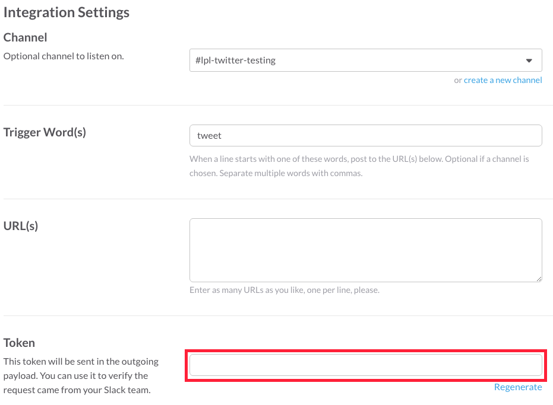

# slack_twitter_app

An app to send tweets from a Slack channel to Twitter.

By [LaunchPad Lab](http://launchpadlab.com).

***

## Details

* Ruby 2.1.2
* Postgres

***

## Setup

1. Click the 'Deploy to Heroku' button.

  ### Create Slack Outgoing Webhook

2. Create Slack Outgoing Webhook using the URL from the Heroku deploy. Make sure to select an appropriate trigger word.

  `https://slack.com/apps/build > Build Your Own > Make a Custom Integration > Outgoing Webhooks`

    

  ***

  ### Create New Twitter Application
  
3. Create a new Twitter application using your account.
  
  `https://apps.twitter.com/ > Create New App`

    * Use any name and description.
    * Website: use the URL from the Heroku deploy.
    * Callback URL: use the URL from the Heroku deploy + '/auth/twitter/callback/', e.g., 
    
    `'https://immense-garden-20341.herokuapp.com/auth/twitter/callback'`

    

  ***

  ### Heroku

4. Add your Twitter API Key and Secret Key as environment variables through the Heroku web UI or command line interface:

  ~~~~
  $ heroku config:set TWITTER_KEY=...

  $ heroku config:set TWITTER_SECRET_KEY=...
  ~~~~

    

5. Add your Slack team domain and token from the Outgoing Webhook you created as environment variables through Heroku.

  ~~~~
  $ heroku config:set SLACK_TEAM_DOMAIN=...

  $ heroku config:set SLACK_TOKEN=...
  ~~~~

    

  ### Final Steps

6. Visit your freshly deployed Heroku app and sign in (using Twitter OAuth).
7. Get to tweeting using your Slack channel!
