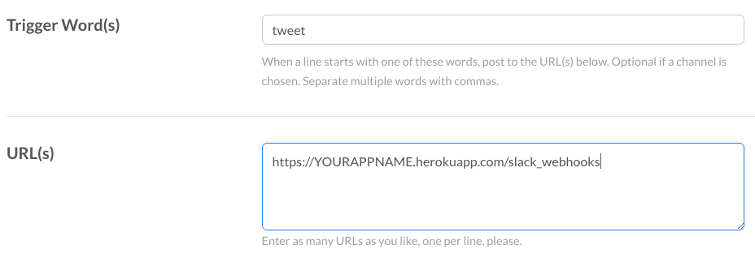
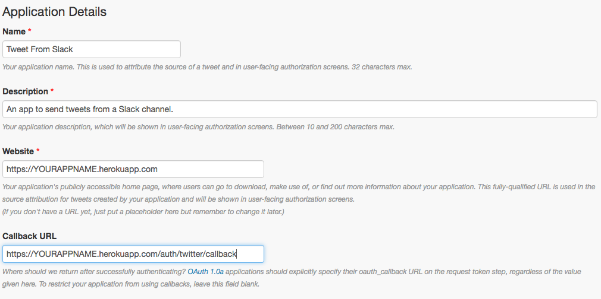
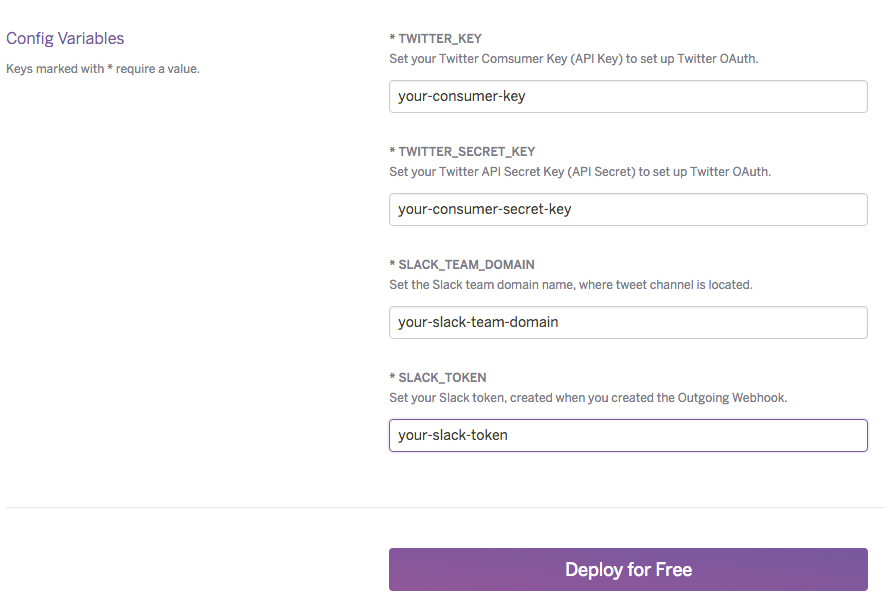

#  Tweet from Slack! 

Tweet while you Slack! You're already using Slack for all forms of communication, why not send tweets to Twitter from Slack, too?
The Slack Twitter app makes it simple to send tweets from a Slack channel.

By [LaunchPad Lab](http://launchpadlab.com).

***

TODO - add a detailed description including requirements (ie paid heroku account)
## Overview
The Slack Twitter App uses Twitter OAuth to authenticate your Twitter account. You will need a paid Heroku account in order to use
the Memcachier add-on that Tweet from Slack requires (although the add-on is free).

***

## Setup
1. [Create a new Slack Outgoing Webhook](#create-a-new-slack-outgoing-webhook)
2. [Create a new Twitter Application](#create-a-new-twitter-application)
3. [Deploy to Heroku](#deploy-to-heroku)
4. [Update URLs](#update-urls)
5. [Final Steps](#final-steps)

### Create a new Slack Outgoing Webhook

Create a new Slack Outgoing Webhook using your account.

[Slack Custom Integration](https://slack.com/apps/build/custom-integration) > Outgoing Webhooks

* Add Outgoing WebHooks integration (if this is your first integration)
* Trigger Word: This is the command used to send the tweet. We use 'tweet', but you can use whatever you want.
* URL: `https://YOURAPPNAME.herokuapp.com/slack_webhooks` (we will update this later)
* Keep this window open, we will need some of the settings later.

***

### Create a new Twitter Application

Create a new Twitter application using your account. If you haven't already, you will have to add your phone number to your Twitter account before you can create a Twitter application.

[Twitter Apps](https://apps.twitter.com/) > Create New App

* Name: anything
* Description: anything
* Website: `https://YOURAPPNAME.herokuapp.com` (we will update this later)
* Callback URL: `https://YOURAPPNAME.herokuapp.com/auth/twitter/callback` (we will update this later)
* Agree to the Developer Agreement
* Create your Twitter application
* Keep this window open, we will need some of the settings later.

***

### Deploy to Heroku

 (Click me)

* App Name: anything (we will replace 'YOURAPPNAME' in the Slack and Twitter configuration with this value)
* Config variables
 * TWITTER_KEY: Consumer Key from Twitter
 * TWITTER_SECRET_KEY: Consumer Secret from Twitter
 * SLACK_TEAM_DOMAIN: Your slack team domain (ours is 'launchpadlab')
 * SLACK_TOKEN: Token from Slack Outgoing Webhook configuration

### Update URLs
Replace 'YOURAPPNAME' with your Heroku app name in:
* Slack URL
* Twitter Website
* Twitter Callback URL

### Final Steps
Visit your freshly deployed Heroku app and sign in with your Twitter credentials and start tweeting from Slack!!!
